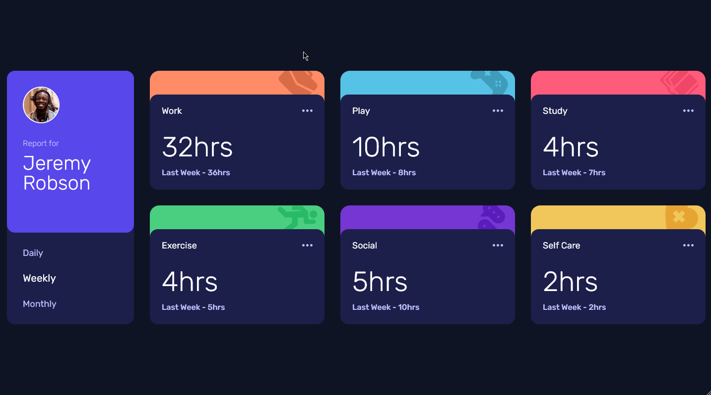
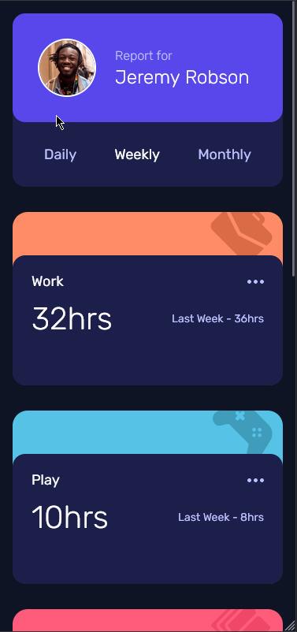

# Frontend Mentor - Time tracking dashboard

## Welcome! 👋

Thanks for checking out this front-end coding challenge.

[Frontend Mentor](https://www.frontendmentor.io) challenges help you improve your coding skills by building realistic projects.

**To do this challenge, you need a basic understanding of HTML, CSS and JavaScript.**

## The challenge

Your challenge is to build out this dashboard and get it looking as close to the design as possible.

You can use any tools you like to help you complete the challenge. So if you've got something you'd like to practice, feel free to give it a go.

If you would like to practice working with JSON data, we provide a local `data.json` file for the activities. This means you'll be able to pull the data from there instead of using the content in the `.html` file.

Your users should be able to:

- View the optimal layout for the site depending on their device's screen size
- See hover states for all interactive elements on the page
- Switch between viewing Daily, Weekly, and Monthly stats

Want some support on the challenge? [Join our Slack community](https://www.frontendmentor.io/slack) and ask questions in the **#help** channel.

### Expected behaviour

- The text for the previous period's time should change based on the active timeframe. For Daily, it should read "Yesterday" e.g "Yesterday - 2hrs". For Weekly, it should read "Last Week" e.g. "Last Week - 32hrs". For monthly, it should read "Last Month" e.g. "Last Month - 19hrs".

## Table of contents

- [Overview](#overview)
  - [Screenshot](#screenshot)
  - [Links](#links)
- [My process](#my-process)
  - [Built with](#built-with)
  - [What I learned](#what-i-learned)
  - [Continued development](#continued-development)
  - [Useful resources](#useful-resources)
- [Author](#author)

## Overview

### Screenshot

### Links

- Source Code URL: [Source Github](https://github.com/lenez12/time-tracking-dashboard-main.git)
- Live Site URL: [Demo Live](https://lenez-time.netlify.app)

## My process

### Built with

- Semantic HTML5 markup
- CSS custom properties
- Flexbox
- Grid CSS
- SCSS
- CSS5 Animation

### What I learned

what I learned in making this challenge is:

1. using grid css for layouting content
2. i user media Query to build responsive for mobile combinating with grid css
3. using animation
4. get data using fetch
5. manipulate dom
6. remove dom element
7. using postion and background-image position

### Continued development

1. In the future I will make a good css class naming name
2. add transition and animation on content when appears
3. semantic tag

### Useful resources

- [CSS Grid Layout](https://www.w3schools.com/css/css_grid.asp)
- [Reset CSS](https://nicolas-cusan.github.io/destyle.css/)

## Author

- Frontend Mentor - [@Lenez](https://www.frontendmentor.io/profile/lenez12)
- Twitter - [@prak_tech](https://www.twitter.com/prak_tech)

